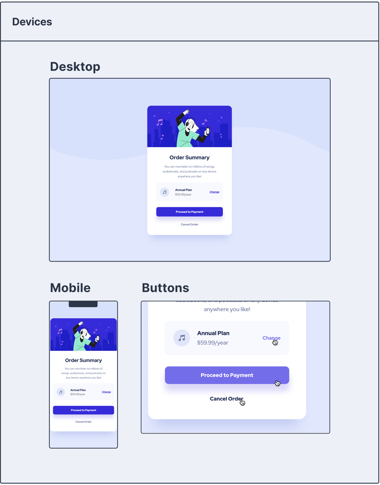

# Frontend Mentor - Order Summary Card Solution

This is a solution to the [Order Summary Card Challenge on Frontend Mentor](https://www.frontendmentor.io/challenges/order-summary-component-QlPmajDUj). Frontend Mentor challenges help you improve your coding skills by building realistic projects. 

## Table of contents

- [Overview](#overview)
  - [The challenge](#the-challenge)
  - [Screenshot](#screenshot)
  - [Links](#links)
  - [Built with](#built-with)
- [Author](#author)

## Overview

### The challenge

Users should be able to:

- See hover states for interactive elements

### Screenshot

### Links

- Solution URL: (https://github.com/ahzeeee/Porfolio/tree/main/OrderSummaryComponent)
- Live Site URL: (https://ahzeeee.github.io/Porfolio/OrderSummaryComponent/index.html)

### Built with

- Semantic HTML5 markup
- CSS custom properties
- Flexbox
- CSS Grid
- Mobile-first workflow
- [Bootstrap](https://getbootstrap.com/docs/4.0/getting-started/introduction/)

## Author

- Zee Wang
- Frontend Mentor - [@ahzeeee](https://www.frontendmentor.io/profile/ahzeeee)

